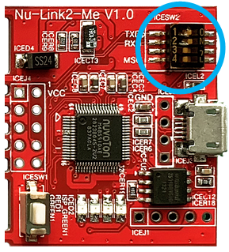
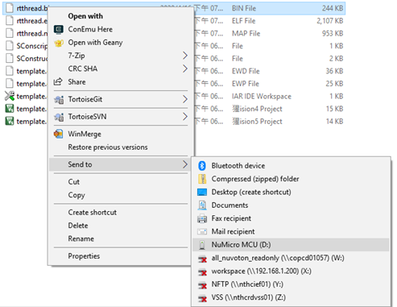

# NuMaker-M55M1

## 1. Introduction

The NuMicro® M55M1/M5531 series microcontrollers stand out for their exceptional performance in digital signal processing and in-device machine learning inference. They are equipped with an Arm® Cortex®-M55 processor running up to 220 MHz. In addition to the Cortex-M55 core, they integrate an Arm® Ethos™-U55 Neural Processing Unit (NPU) as a coprocessor for accelerating neural network operations. The M55M1 series MCU has up to 1.5 MB of SRAM and 2 MB of flash memory for on-chip storage and adopts OctoSPI and HyperBus interfaces to support the expansion of RAM and flash memory capacity. It supports a low power supply voltage range from 1.6V to 3.6V and can operate within a temperature range of -40°C to +105°C.

### 1.1 MCU specification

|  | Features |
| -- | -- |
| MCU | M55M1H2LJAE |
| Operation frequency | 220 MHz |
| embedded Flash size | 2 MB, Dual Bank |
| SRAM size | 1.5 MB |
| RMII interface | Support 10/100 Mbps Ethernet |
| Crypto engine |  TRNG, PRNG, AES, SHA/HMAC, RSA, and ECC crypto accelerator |

### 1.2 Interface

| Interface |
| -- |
| Arduino UNO compatible extension connector |
| MikroBus UNO compatible extension connector |
| RJ45 Ethernet port |
| USB 1.1 and 2.0 OTG ports |
| A microSD slot |
| A 3.5mm Audio connector |
| A CAN FD communication port |
| Debug through SWD interface |
| A LCD panel EBI interface |
| A Camera Capture interface |

### 1.3 On-board devices

| Device | Description | Driver supporting status |
| -- | -- | -- |
| HyperRAM | 64Mb, W956A8MBYA5I | Supported |
| Ethernet PHY | RTL8201F | Supported |
| Audio Codec | NAU88L22 | Supported |
| Digital MIC | IM34DT05 | Supported |

### 1.4 Board extended module

| Device | Description | Driver supporting status |
| -- | -- | -- |
| LCD with TPC Panel | LT7381, FT5446 | Supported |
| LCD with TPC Panel | FSA506, ST1663I | Supported |
| CCAP sensor modules | HM1055, ADV7280 | Supported |

## 2. Supported compiler

Support GCC. More information of these compiler version as following:

| IDE/Compiler  | Tested version            |
| ---------- | ---------------------------- |
| GCC        | GCC 10.3.1 20210824 (release) |

## 3. Drag & Drop Program Firmware

Notice: Function WIP, please use the ICP Program as a substitute

### Step 1

First, configure the switches on the NuMaker-M55M1 board by setting switches No. 1 and 2 to the 'ON' position. Once configured, connect the NuMaker-M55M1 board to your computer using a USB Micro cable. The Windows Device Manager will then display a 'NuMicro MCU' virtual disk, which you can use to burn the firmware.

### Step 2

A simple method for firmware burning is to drag and drop the binary image file onto the NuMicro MCU virtual disk or copy it directly to the NuMicro MCU disk.

## 4. Test

You can use the Tera Term terminal emulator (or any similar software) to enter RTT commands. The image below displays all serial communication parameters. You can also check the Windows Device Manager to find the corresponding port number for the Nuvoton Virtual COM Port.

## 5. Purchase

* [Nuvoton Direct][1]

## 6. Resources

* [AIoT-HMI-UVC Demo Video Clip][2]

  [1]: https://direct.nuvoton.com/en/numaker-m55m1
  [2]: https://www.youtube.com/watch?v=Ycnhv7C_lWM
